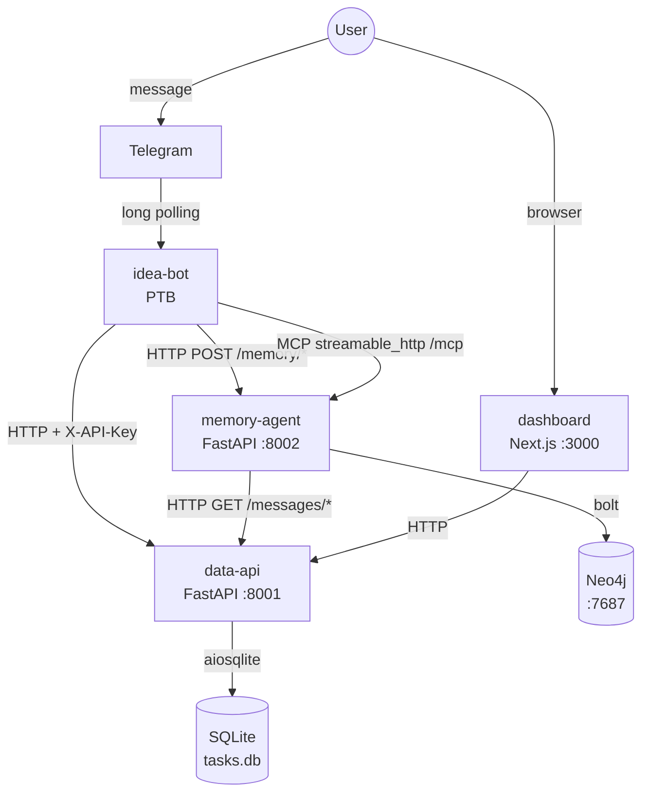
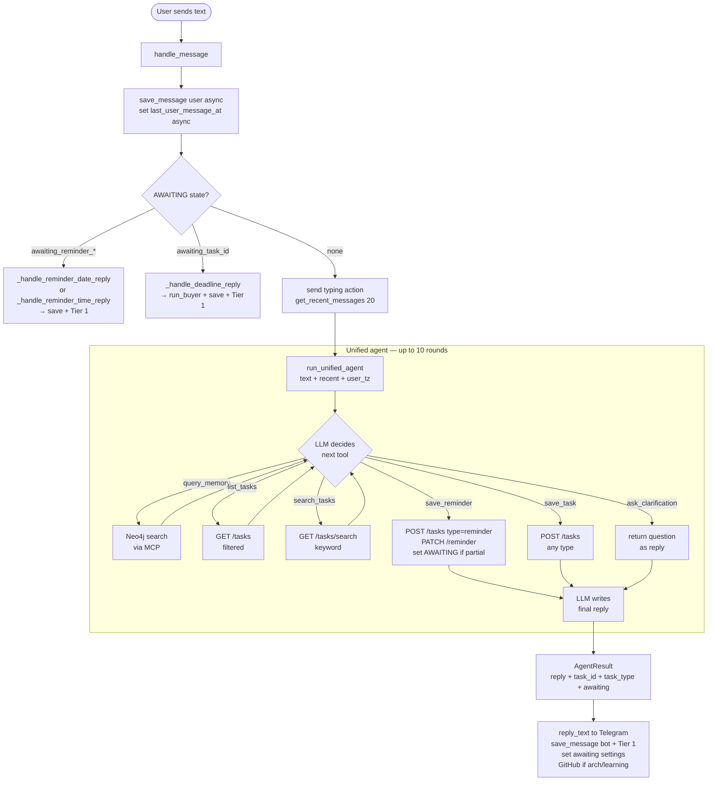
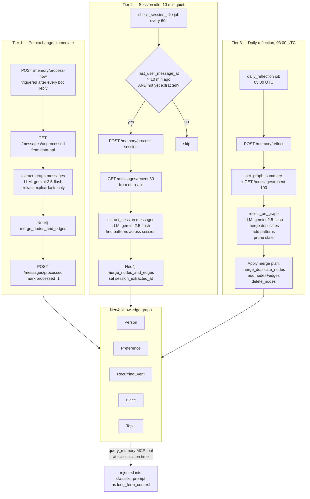
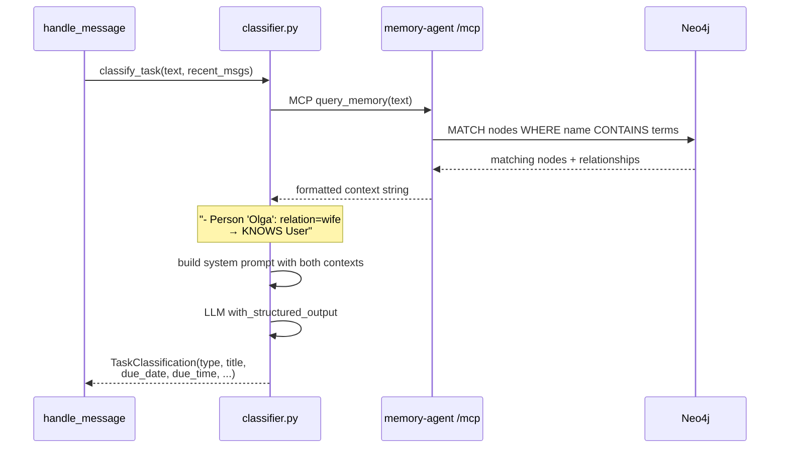
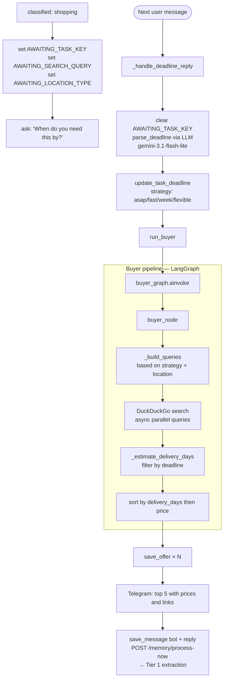
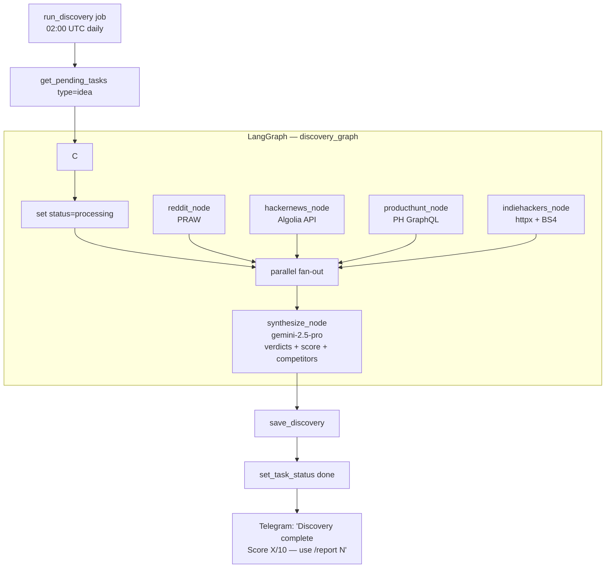
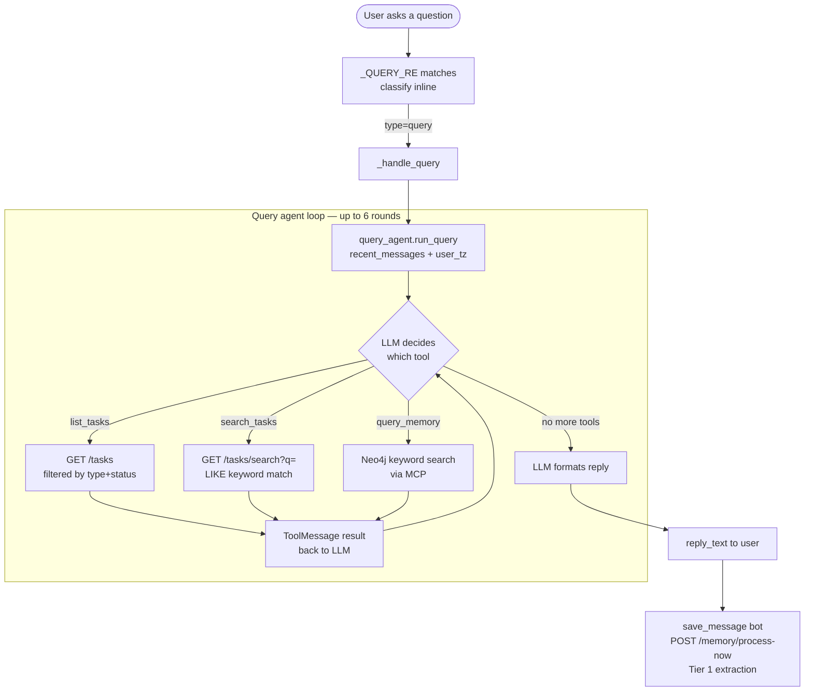

# System Flow Diagrams

## 1. Service map



---

## 2. Every incoming message — full path



---

## 3. Memory system — 3 tiers



---

## 4. MCP tool call during classification



---

## 5. Shopping flow — two-step with deadline



---

## 6. Reminder flow — two-step date+time

```mermaid
flowchart TD
    A[classified: reminder] --> B{due_date\ndue_time\nextracted?}

    B -->|both present\n'tomorrow at 10'| SAVE[update_task_reminder\ndue_date + due_time\nreply confirmed\n— no extra question]

    B -->|only date| C[set AWAITING_REMINDER_TASK_KEY\nset AWAITING_REMINDER_DATE=date\nset AWAITING_REMINDER_TIME=NEEDED\nask for time]

    B -->|only time| D[set AWAITING_REMINDER_TASK_KEY\nset AWAITING_REMINDER_TIME=time\nset AWAITING_REMINDER_DATE=NEEDED\nask for date]

    B -->|neither| E[set AWAITING states\nask for date and time]

    F([Next message]) --> G{which piece\nstill NEEDED?}
    G -->|date| H[_handle_reminder_date_reply\nparse_reminder_datetime LLM\n(extracts date+time together)]
    G -->|time| I[_handle_reminder_time_reply\nparse_reminder_datetime LLM first\nfallback: time_parser regex]

    H --> SAVE
    I --> SAVE

    SAVE --> SAVEMSG[save_message bot + reply\nPOST /memory/process-now\n→ Tier 1 extraction]
    SAVEMSG --> FIRE

    subgraph FIRE [check_reminders job — every 60s]
        J[GET /reminders/due?now=HH:MM\ndue_date+due_time <= now\nnotified_at IS NULL] --> K
        K[send Telegram message] --> L
        L[POST /tasks/id/notified\nsets notified_at + status=done]
    end
```

---

## 7. Idea discovery pipeline — nightly



---

## 8. Scheduled jobs timeline

```
UTC time    Job                     Trigger         What it does
──────────────────────────────────────────────────────────────────────────────
Every 10s   (startup warmup)
Every 60s   check_reminders         run_repeating   Fire due date+time reminders
Every 60s   check_completions       run_repeating   Notify newly-done tasks
Every 60s   check_session_idle      run_repeating   Tier 2 if user quiet 10+ min
02:00 UTC   run_discovery           run_daily       Nightly idea validation
03:00 UTC   daily_reflection        run_daily       Tier 3 Neo4j graph cleanup

Event-driven (not scheduled):
  After every bot reply → POST /memory/process-now  (Tier 1, immediate)
  After shopping classified → ask deadline → run_buyer (immediate)
  After reminder classified → ask date/time if missing (interactive)
```

---

## 9. Data flow between services

```mermaid
flowchart LR
    subgraph BOT [idea-bot process]
        HM[handle_message] --> DC[db/client.py]
        UA[unified_agent.py] -->|MCP| MA
        TJ[jobs/memory.py] -->|HTTP| MA
        RJ[jobs/reminders.py] --> DC
        NJ[jobs/notifier.py] --> DC
        DJ[jobs/discovery.py] --> DC
        BJ[jobs/buyer.py] --> DC
    end

    subgraph API [data-api process]
        DC -->|HTTP REST| EP[endpoints]
        EP --> SQ[(SQLite)]
    end

    subgraph MEM [memory-agent process]
        MA[/mcp + /memory/*] --> EX[extractor.py\nLLM calls]
        MA --> GC[graph_client.py]
        MA -->|GET /messages/*| EP
        GC --> NEO[(Neo4j)]
    end
```

---

## 10. Query agent flow (superseded)

> **This flow is no longer active.** Query handling is now done inside the unified agent loop (see Diagram 2). `agent/query_agent.py` and `_handle_query` are kept for reference but are not called from `bot/handlers/idea.py`.
>
> In the new flow, when the LLM determines a message is a query it calls `list_tasks` and/or `search_tasks` within the unified agent loop, then calls `save_task(type="query")` to record it, and returns a formatted reply — all in one run.


